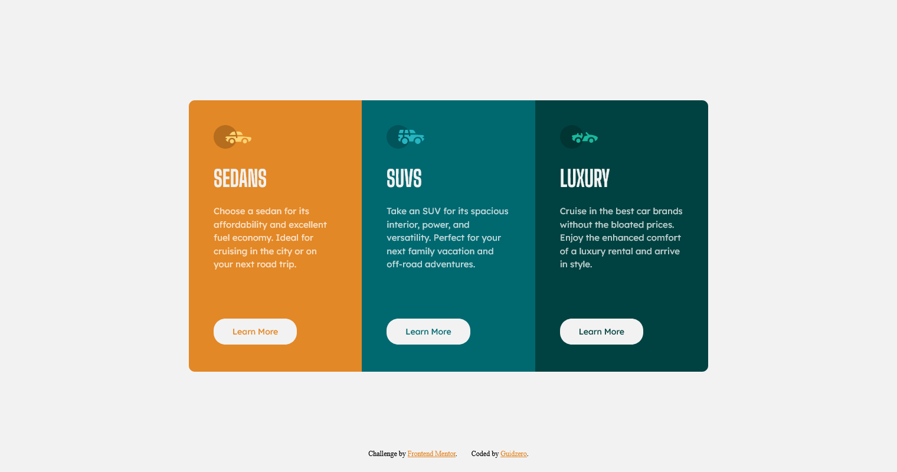

# Frontend Mentor - 3-column preview card component solution

This is a solution to the [3-column preview card component challenge on Frontend Mentor](https://www.frontendmentor.io/challenges/3column-preview-card-component-pH92eAR2-). Frontend Mentor challenges help you improve your coding skills by building realistic projects.

## Table of contents

- [Overview](#overview)
  - [The challenge](#the-challenge)
  - [Screenshot](#screenshot)
  - [Links](#links)
- [My process](#my-process)
  - [Built with](#built-with)
  - [What I learned](#what-i-learned)
- [Author](#author)

## Overview

### The challenge

Users should be able to:

- View the optimal layout depending on their device's screen size
- See hover states for interactive elements

### Screenshot



### Links

- Live Site URL: [https://guidoperezr.github.io/web-design-collection/3-column-preview-card-component-main/](https://guidoperezr.github.io/web-design-collection/3-column-preview-card-component-main/)

## My process

### Built with

- Semantic HTML5 markup
- CSS custom properties
- Flexbox
- CSS Grid
- CSS Nesting

### What I learned

In this component I improve my responsive design and I like how it works

- I learned how to create global variables to use colors in different elements

```css
:root {
  --bright-orange: hsl(31, 77%, 52%);
  --dark-cyan: hsl(184, 100%, 22%);
  --very-dark-cyan: hsl(179, 100%, 13%);
  --transparent-white: hsla(0, 0%, 100%, 0.75);
  --very-light-gray: hsl(0, 0%, 95%);
}
```

- I learned how to use responsive sizes with max and min width

```css
.container {
  display: grid;
  grid-template-columns: repeat(3, 1fr);
  border-radius: 10px;
  max-width: 880px;
  height: auto;
  margin: 24px;
  overflow: hidden;
}
```

## Author

- GitHub - [GuidoPerezR](https://github.com/GuidoPerezR)
- Frontend Mentor - [@GuidoPerezR](https://www.frontendmentor.io/profile/GuidoPerezR)
- X - [@GU1DZ3RO](https://x.com/GU1DZ3RO)
