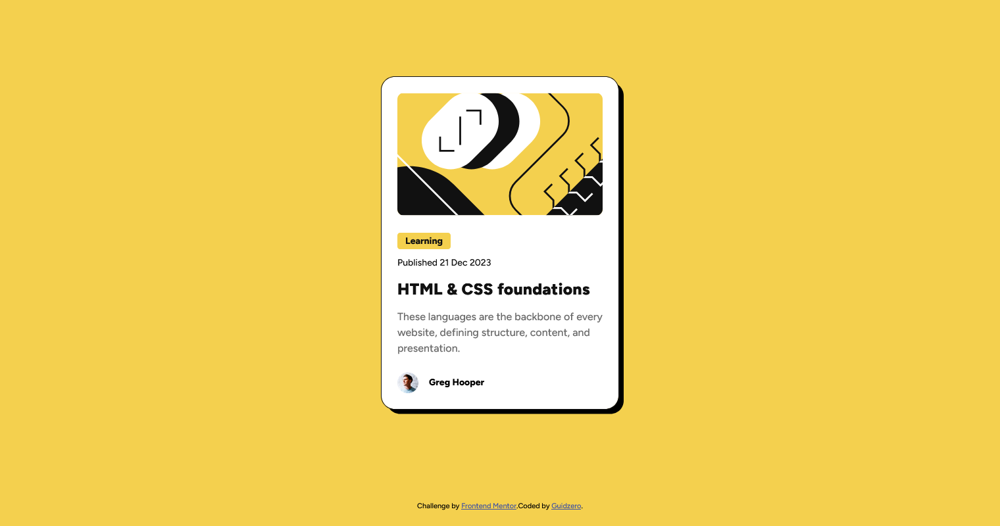

# Frontend Mentor - Blog preview card solution

This is a solution to the [Blog preview card challenge on Frontend Mentor](https://www.frontendmentor.io/challenges/blog-preview-card-ckPaj01IcS). Frontend Mentor challenges help you improve your coding skills by building realistic projects.

## Table of contents

- [Overview](#overview)
  - [The challenge](#the-challenge)
  - [Screenshot](#screenshot)
  - [Links](#links)
- [My process](#my-process)
  - [Built with](#built-with)
  - [What I learned](#what-i-learned)
- [Author](#author)

## Overview

### The challenge

Users should be able to:

- See hover and focus states for all interactive elements on the page

### Screenshot



### Links

- Live Site URL: [https://guidoperezr.github.io/web-design-collection/blog-preview-card-main/](https://guidoperezr.github.io/web-design-collection/blog-preview-card-main/)

## My process

### Built with

- Semantic HTML5 markup
- CSS custom properties
- Flexbox

### What I learned

In this component I was able to design a blog card component, improving my responsive design and how important it is.

- I learn more about the tag 'span', It's not useful for a semantic HTML but could help to create design for specific elements

```html
<div class="blog-content">
  <p><span>Learning</span></p>
</div>
```

- I learned how use fonts that are already downloaded in my project

```css
@font-face {
  font-family: "Figtree-ExtraBold";
  src: url("./assets/fonts/static/Figtree-ExtraBold.ttf") format("truetype");
}
```

- I learned how to create areas with grid

```css
body {
  margin: 0;
  padding: 0;
  display: grid;
  min-height: 100dvh;
  grid-template-rows: 1fr auto;
  place-items: center;
  background: hsl(47, 88%, 63%);
}
```

- I used nesting CSS for a clearer code

```css
.blog-content h1 {
  font-family: Figtree-ExtraBold;
  font-size: 24px;
  line-height: 150%;
  color: hsl(0, 0%, 7%);

  &:hover {
    color: hsl(47, 88%, 63%);
    cursor: pointer;
  }
}
```

## Author

- GitHub - [GuidoPerezR](https://github.com/GuidoPerezR)
- Frontend Mentor - [@GuidoPerezR](https://www.frontendmentor.io/profile/GuidoPerezR)
- X - [@GU1DZ3RO](https://x.com/GU1DZ3RO)
