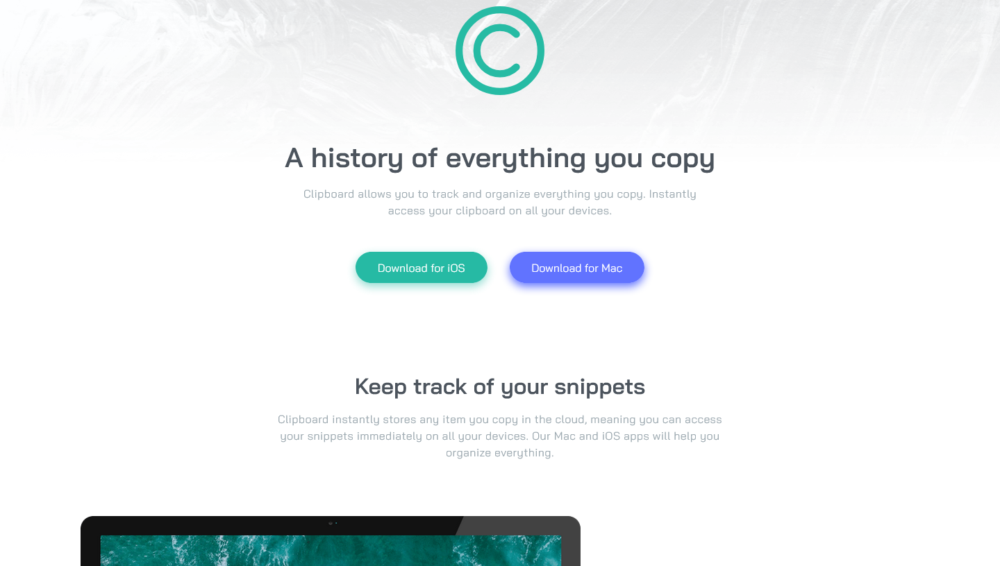

# Frontend Mentor - Clipboard landing page solution

This is a solution to the [Clipboard landing page challenge on Frontend Mentor](https://www.frontendmentor.io/challenges/clipboard-landing-page-5cc9bccd6c4c91111378ecb9). Frontend Mentor challenges help you improve your coding skills by building realistic projects.

## Table of contents

- [Overview](#overview)
  - [The challenge](#the-challenge)
  - [Screenshot](#screenshot)
  - [Links](#links)
- [My process](#my-process)
  - [Built with](#built-with)
  - [What I learned](#what-i-learned)
  - [Continued development](#continued-development)
  - [Useful resources](#useful-resources)
- [Author](#author)
- [Acknowledgments](#acknowledgments)

**Note: Delete this note and update the table of contents based on what sections you keep.**

## Overview

### The challenge

Users should be able to:

- View the optimal layout for the site depending on their device's screen size
- See hover states for all interactive elements on the page

### Screenshot



### Links

- Live Site URL: [https://guidoperezr.github.io/web-design-collection/clipboard-landing-page-master/](https://guidoperezr.github.io/web-design-collection/clipboard-landing-page-master/)

## My process

### Built with

- Semantic HTML5 markup
- CSS custom properties
- Flexbox
- CSS Grid
- CSS Nesting

### What I learned

- I started to use transitions in buttons

```css
.ios-button {
  text-decoration: none;
  background: var(--strong-cyan);
  padding: 0.8rem 2rem;
  border-radius: 40px;
  color: white;
  box-shadow: 0px 5px 12px hsla(171, 66%, 44%, 0.5);
  transition: transform 0.3s ease;

  &:hover {
    transform: translateY(-5px);
  }
}
```

- I learned how to use rem in containers, paddins, font-size, etc.

```css
.hero {
  display: flex;
  flex-direction: column;
  justify-content: center;
  align-items: center;
  gap: 1rem;
  max-width: 39rem;

  & header {
    display: flex;
    flex-direction: column;
    justify-content: center;
    align-items: center;
    gap: 4rem;
  }
}
```

## Author

- GitHub - [GuidoPerezR](https://github.com/GuidoPerezR)
- Frontend Mentor - [@GuidoPerezR](https://www.frontendmentor.io/profile/GuidoPerezR)
- X - [@GU1DZ3RO](https://x.com/GU1DZ3RO)
