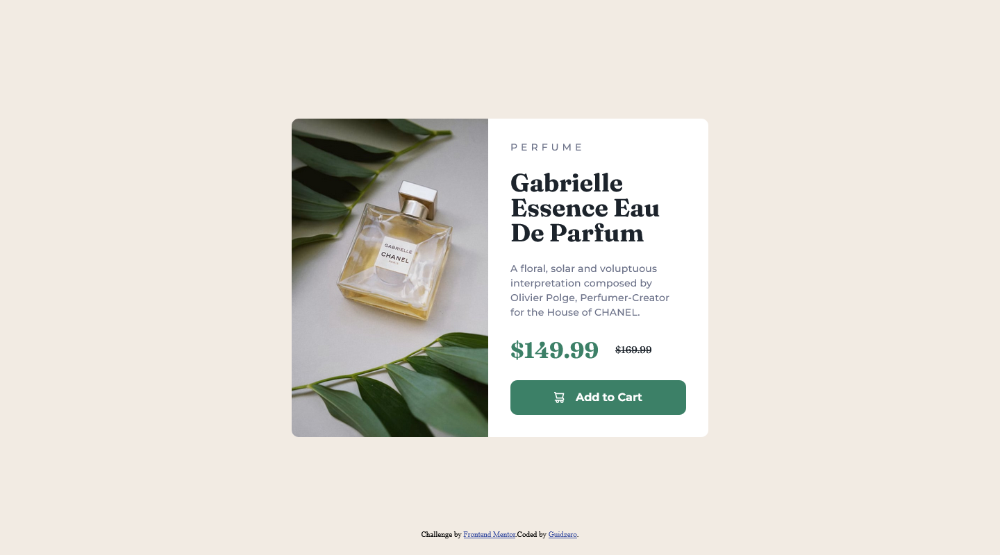

# Frontend Mentor - Product preview card component solution

This is a solution to the [Product preview card component challenge on Frontend Mentor](https://www.frontendmentor.io/challenges/product-preview-card-component-GO7UmttRfa). Frontend Mentor challenges help you improve your coding skills by building realistic projects.

## Table of contents

- [Overview](#overview)
  - [The challenge](#the-challenge)
  - [Screenshot](#screenshot)
  - [Links](#links)
- [My process](#my-process)
  - [Built with](#built-with)
  - [What I learned](#what-i-learned)
  - [Continued development](#continued-development)
  - [Useful resources](#useful-resources)
- [Author](#author)

## Overview

### The challenge

Users should be able to:

- View the optimal layout depending on their device's screen size
- See hover and focus states for interactive elements

### Screenshot



### Links

- Live Site URL: [Add live site URL here](https://guidoperezr.github.io/web-design-collection/product-preview-card-component-main/)

## My process

### Built with

- Semantic HTML5 markup
- CSS custom properties
- Flexbox
- [Fonts](https://fonts.google.com/) - For fonts

### What I learned

In this component I learned how to create a card component about a product, also how to use images with a responsive design and how important is that my product could be visible for all the devices.

- I learned how to import several fonts in one url

```html
<link rel="preconnect" href="https://fonts.googleapis.com" />
<link rel="preconnect" href="https://fonts.gstatic.com" crossorigin />
<link
  href="https://fonts.googleapis.com/css2?family=Fraunces:ital,opsz,wght@0,9..144,100..900;1,9..144,100..900&family=Montserrat:ital,wght@0,100..900;1,100..900&display=swap"
  rel="stylesheet"
/>
```

- I learned how to use images depending on the size of the screen

```html
<picture>
  <source
    srcset="./images/image-product-mobile.jpg"
    media="(max-width: 699px)"
  />
  
</picture>
```

- I learned how to maintain the ratio of my image in a container
```css
.product-image{
    display: block;
    width: 100%;
    height: 100%;
    object-fit: cover;
}
```

### Continued development

I'll continue to experiment with components and layouts to use in my future projects

### Useful resources

- [Example resource 1](https://fonts.google.com/) - This helped me to import fonts and learned more about them.

## Author

- GitHub - [GuidoPerezR](https://github.com/GuidoPerezR)
- Frontend Mentor - [@GuidoPerezR](https://www.frontendmentor.io/profile/GuidoPerezR)
- X - [@GU1DZ3RO](https://x.com/GU1DZ3RO)