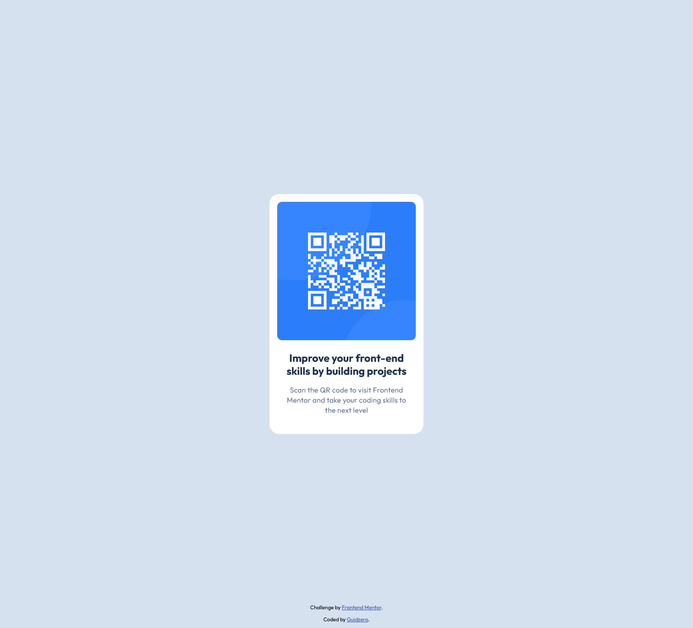

# Frontend Mentor - QR code component solution

This is a solution to the [QR code component challenge on Frontend Mentor](https://www.frontendmentor.io/challenges/qr-code-component-iux_sIO_H). Frontend Mentor challenges help you improve your coding skills by building realistic projects.

## Table of contents

- [Overview](#overview)
  - [Screenshot](#screenshot)
  - [Links](#links)
- [My process](#my-process)
  - [Built with](#built-with)
  - [What I learned](#what-i-learned)
  - [Continued development](#continued-development)
  - [Useful resources](#useful-resources)
- [Author](#author)

## Overview

### Screenshot



### Links

- Live Site URL: [Add live site URL here](https://guidoperezr.github.io/web-design-collection/qr-code-component-main/)

## My process

### Built with

- Semantic HTML5 markup
- CSS custom properties
- Flexbox
- [Fonts](https://fonts.google.com/) - For fonts

### What I learned

In this project I started to implement basic web development knowledge, but some interestinng features that I searched and learned were the following:

- I learned how to import fonts in my HTML project and use them in some elements of my page

```html
<link rel="preconnect" href="https://fonts.googleapis.com" />
<link rel="preconnect" href="https://fonts.gstatic.com" crossorigin />
<link
  href="https://fonts.googleapis.com/css2?family=Outfit:wght@100..900&display=swap"
  rel="stylesheet"
/>
```

- I learned how to occupy all the space of the viewport in one element

```css
body {
  padding: 0;
  margin: 0;
  background: #d5e1ef;
  font-family: Outfit;
  width: 100%;
  height: 100%;
}
```

- I center a div

```css
.card {
  position: absolute;
  inset: 0;
  margin: auto;
  background: white;
  width: 320px;
  height: 499px;
  box-sizing: border-box;
  display: flex;
  flex-direction: column;
  gap: 24px;
  border-radius: 20px;
  padding: 16px 16px 24px;
}
```

- I create a footer

```css
footer {
  position: absolute;
  bottom: 0;
  right: 0;
  left: 0;
}
```

### Continued development

In my next projects I will keep consider important make semantic HTML creating websites with more elements and start designing notable UI's

### Useful resources

- [Example resource 1](https://fonts.google.com/) - This helped me to import fonts and learned more about them.

## Author

- GitHub - [GuidoPerezR](https://github.com/GuidoPerezR)
- Frontend Mentor - [@GuidoPerezR](https://www.frontendmentor.io/profile/GuidoPerezR)
- X - [@GU1DZ3RO](https://x.com/GU1DZ3RO)
