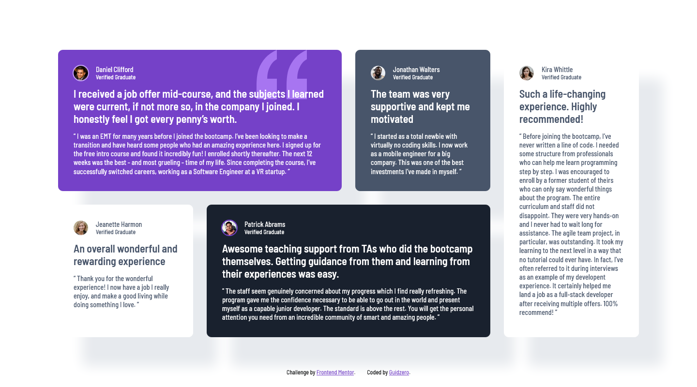

# Frontend Mentor - Testimonials grid section solution

This is a solution to the [Testimonials grid section challenge on Frontend Mentor](https://www.frontendmentor.io/challenges/testimonials-grid-section-Nnw6J7Un7). Frontend Mentor challenges help you improve your coding skills by building realistic projects.

## Table of contents

- [Overview](#overview)
  - [The challenge](#the-challenge)
  - [Screenshot](#screenshot)
  - [Links](#links)
- [My process](#my-process)
  - [Built with](#built-with)
  - [What I learned](#what-i-learned)
  - [Continued development](#continued-development)
  - [Useful resources](#useful-resources)
- [Author](#author)
- [Acknowledgments](#acknowledgments)

**Note: Delete this note and update the table of contents based on what sections you keep.**

## Overview

### The challenge

Users should be able to:

- View the optimal layout for the site depending on their device's screen size

### Screenshot



### Links

- Live Site URL: [https://guidoperezr.github.io/web-design-collection/testimonials-grid-section-main/](https://guidoperezr.github.io/web-design-collection/testimonials-grid-section-main/)

## My process

### Built with

- Semantic HTML5 markup
- CSS custom properties
- Flexbox
- CSS Grid
- CSS Nesting

### What I learned

- I learned how a grid display works and how to manipulate rows and columns in a component

```css
.container {
  display: grid;
  grid-template-columns: repeat(4, 1fr);
  grid-auto-rows: auto;
  gap: 28px;
  max-width: 1200px;
  margin: 24px;
}
```

- I learned how a shadow and z-index works

```css
.testimonial-card {
  display: flex;
  flex-direction: column;
  gap: 14px;
  border-radius: 10px;
  box-shadow: 50px 60px 25px var(--grey-100);
  padding: 32px;
  box-sizing: border-box;
  z-index: 2;
}
```

- I learned how to make a responsive design using display grid

```css
body {
  height: auto;
  grid-template-rows: 1fr auto;
  margin: 42px 0px;
}

.testimonial-card:nth-child(n) {
  grid-column: 1;
  grid-row: auto;
}
```

## Author

- GitHub - [GuidoPerezR](https://github.com/GuidoPerezR)
- Frontend Mentor - [@GuidoPerezR](https://www.frontendmentor.io/profile/GuidoPerezR)
- X - [@GU1DZ3RO](https://x.com/GU1DZ3RO)
